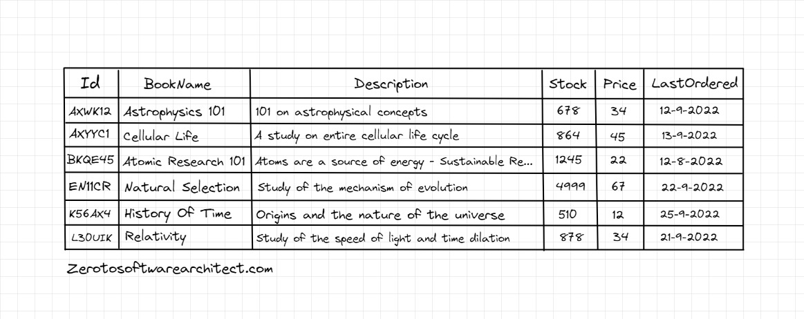
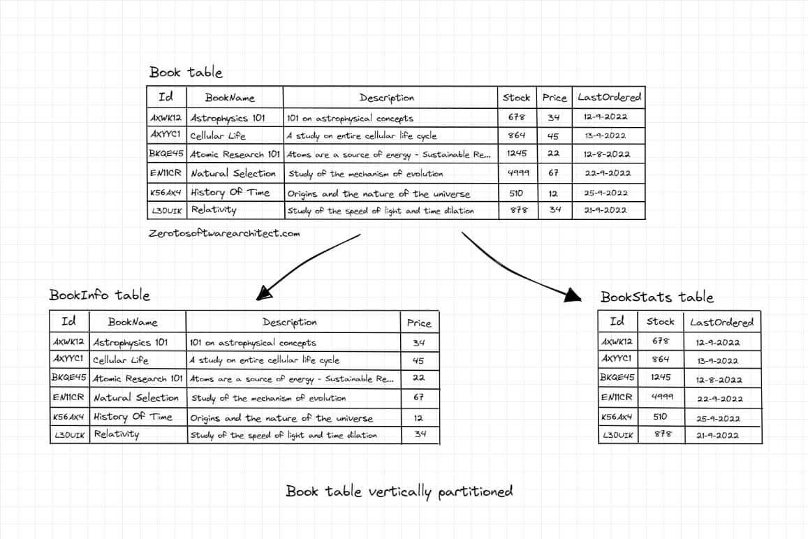
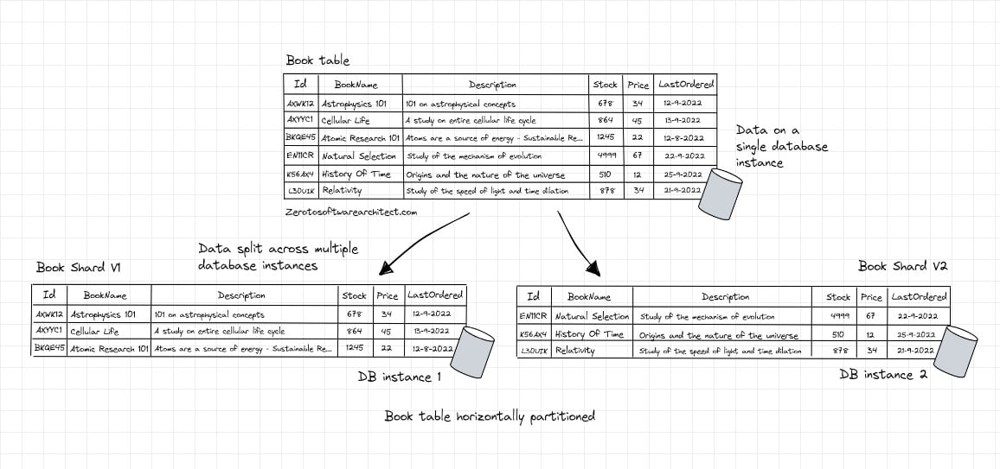

# Partitioning

**Database partitioning** is a technique used to improve the performance, manageability, and scalability of a database by dividing it into smaller, more manageable pieces called **partitions**. This is particularly useful for large databases with high volumes of read and write operations, as it allows for better load distribution and parallel processing. Partitioning can be done in several ways, depending on the requirements and structure of the database.

## Vertical Partitioning

**Vertical database partitioning**, also known as **columnar partitioning**, is a technique used to divide a large database table into smaller, more manageable tables based on columns. This method improves the performance, scalability, and manageability of the database by reducing the amount of data that needs to be read or written when querying the database.

Vertical partitioning is particularly useful when the table contains many columns, and only a few of them are accessed frequently or together.

Here's how vertical partitioning works:

1. **Identify columns**: First, analyze the database workload and query patterns to determine which columns are accessed together or more frequently than others. These columns are good candidates for vertical partitioning.

2. **Split the table**: Create new tables by grouping the identified columns together. Each new table will have a smaller number of columns compared to the original table. Be sure to include the primary key or a unique identifier in each partitioned table to maintain referential integrity.

3. **Update queries**: Modify the application or SQL queries to access the new partitioned tables instead of the original table. This may involve updating join statements or creating views that combine the partitioned tables to provide a unified access point.

4. **Maintain referential integrity**: To ensure data consistency, you may need to create foreign key constraints between the partitioned tables or implement triggers to keep the data synchronized when updates, inserts, or deletes occur.

### Example



In a bookstore's database table called `Book`, the table can be divided into two smaller tables: `BookInfo` and `BookStats`. The `BookInfo` table contains columns like `BookName`, `Description`, and `Price`, while the `BookStats` table has columns for `Stock` and `LastOrdered`.



The application frequently retrieves data from the `BookInfo` table to show it to buyers, but it only accesses the `BookStats` table when a buyer adds an item to the cart and proceeds to checkout.

Since the data in the `BookInfo` table is mostly static, it can be cached. However, the data in the `BookStats` table is dynamic and requires more concurrent writes.

The application can efficiently perform read operations on the `BookInfo` table, and strict isolation levels can be applied to the `BookStats` table for consistency. This approach improves the application's performance.

Partitioning allows for better data isolation and management of concurrent scenarios. It also enables applying suitable security controls and business rules to each table. For example, sensitive data can be moved to a separate table with encryption and strict security controls. Partitioning the data into smaller tables provides greater operational flexibility.

*Vertical partitioning*, which is popular in wide-column databases, involves storing smaller tables on the same database instance. Although this method improves query performance, it has limitations in terms of storage capacity. To accommodate growing data sizes, horizontal partitioning, also known as ***Sharding***, may be necessary.

### Advantages of vertical partitioning:

- **Improved performance**: By reducing the number of columns accessed in a query, you can decrease the amount of data that needs to be read, which leads to faster query execution.

- **Better resource utilization**: Vertical partitioning allows for better usage of system resources, such as memory and CPU, since only the necessary data is loaded into memory for processing.

- **Scalability**: Vertical partitioning can help distribute the data across multiple servers, improving the overall performance and scalability of the system.

- **Easier maintenance**: Partitioning can simplify the process of managing large tables by breaking them down into smaller, more manageable pieces.

However, vertical partitioning also has some drawbacks, such as increased complexity in managing the database schema and queries, and the need for careful planning to ensure data consistency and referential integrity. It's essential to analyze the database workload and requirements thoroughly before deciding on a partitioning strategy.

## Horizontal Partitioning aka Sharding

As opposed to splitting columns, in horizontal partitioning, a large table is split into smaller tables with fewer rows, having the same number of columns.

### Example



The book table is divided into shards based on a ***key*** that is the book `Id`. This will enable the application to spread the load across several database instances, reducing the load on individual machines, averting the risk of any of them going down.

The sharding key must ensure the data is spread evenly across the shards. The shards don't necessarily have to be of the same size, though it's important to balance the traffic across the shards. A certain shard receiving most of the application traffic would defeat the purpose of sharding our database.

**Horizontal database partitioning**, commonly known as sharding, is a technique used to improve the performance, scalability, and manageability of a database by splitting a large table into smaller, more manageable pieces based on rows. Each shard or partition contains a subset of the data, and these smaller tables have the same schema as the original table. Sharding is particularly useful when dealing with large datasets and high volumes of read and write operations.

# Partitioning Strategies

There are several partitioning strategies based on which a big table is split into shards. A few of the popular ones are:

## Range-based Partitioning

**Range-based sharding** is a horizontal partitioning technique in which a large database table is divided into smaller, more manageable pieces based on a specific range of values for a chosen column. Each partition, or shard, contains data within a specific range and has the same schema as the original table. This type of sharding is particularly useful when dealing with data that can be logically grouped by ranges, such as timestamps, numerical values, or even alphabetical ranges.

### To implement range-based sharding, follow these steps:

1. **Choose the shard key**: Select a column that will serve as the basis for defining the ranges. Ideally, this column should have a natural order and evenly distribute data across the shards. Common choices include timestamps, numerical identifiers, or alphabetical values.

2. **Define the ranges**: Determine the range of values for each shard. The ranges should be non-overlapping and together should cover the entire possible value space for the shard key. For example, if you're sharding based on timestamps, you might create shards for each month, quarter, or year, depending on the data volume and query patterns.

3. **Create the shards**: Create new tables with the same schema as the original table for each range. Configure each shard to store data only within its specified range.

4. **Route data to shards**: Modify your application or use a database proxy to route write and read operations to the appropriate shard based on the shard key value. When inserting new data, the application should determine which shard the data belongs to and write it to the corresponding shard. When querying data, the application should direct the query to the relevant shard(s) based on the specified criteria.

5. **Handle shard maintenance**: As data grows or query patterns change, you may need to add new shards, merge existing shards, or split shards into smaller ranges. Plan for these operations and ensure that your system can handle them with minimal impact on performance and availability.

### Advantages of range-based sharding:

- **Improved query performance**: Range-based sharding can significantly speed up range queries, as the search can be limited to the relevant shard(s) instead of scanning the entire dataset.

- **Load distribution**: Range-based sharding can help distribute data and query load across multiple servers or storage systems, improving performance and scalability.

- **Data organization**: By logically grouping data based on a specific range, range-based sharding can make it easier to manage and understand the data.

However, range-based sharding also has some drawbacks, such as potential data skew (uneven distribution of data across shards) if the chosen shard key and ranges do not evenly distribute the data. Hotspots may also occur if a specific range receives a higher volume of queries or writes. It's essential to carefully plan and monitor the distribution of data and load across shards to avoid these issues and maintain optimal performance.

In range-based sharding, a ***mapping*** between the ranges and the corresponding shards is maintained to ensure that data is written to the correct shard and that queries are directed to the appropriate shard(s) based on the specified criteria. This mapping can be managed in various ways, depending on the system's architecture and the database management system (DBMS) being used.

Here are some common approaches to maintaining the mapping:

1. **Application-level mapping**: The mapping can be managed within the application code or configuration. This may involve creating a configuration file or a data structure within the application to store the mapping between the ranges and the shard identifiers (e.g., shard names, server addresses, or database connection strings). When the application writes or queries data, it consults the mapping to determine which shard(s) to route the operation to.

2. **Middleware or proxy**: A middleware or proxy layer can be used to manage the mapping and route data operations to the appropriate shards. In this approach, the application sends queries and write operations to the middleware or proxy, which uses the mapping to route the operations to the correct shard(s) based on the shard key value. Middleware solutions like Vitess for MySQL or Citus for PostgreSQL can help manage the mapping and routing for range-based sharding.

3. **Database-level mapping**: Some DBMSs support range-based sharding natively or through extensions, in which case the mapping is managed within the database itself. These systems typically provide built-in mechanisms for defining the ranges and creating the shards, and they handle routing data operations to the appropriate shards based on the shard key value. Examples of DBMSs with native sharding support include Apache Cassandra, Google Cloud Spanner, and Oracle Database.

Regardless of the approach used to maintain the mapping, it's essential to keep the mapping up to date as shards are added, removed, or modified. This may involve updating the application configuration, middleware, or database settings as needed. Additionally, monitoring the distribution of data and load across shards can help ensure that the mapping remains effective and that the system continues to perform optimally.

## Hash-based Partitioning

Hash-based partitioning is a horizontal partitioning technique in which a large database table is divided into smaller, more manageable pieces (partitions or shards) based on a hash function applied to a chosen shard key column. The hash function generates a consistent output value for a given input value, effectively distributing the data across the shards in a deterministic manner. This type of partitioning can be useful when the data doesn't have a natural order or logical ranges but needs to be evenly distributed across multiple servers or storage systems.

### To implement hash-based partitioning, follow these steps:

1. **Choose the shard key**: Select a column that will be used as the input to the hash function. Ideally, this column should have a relatively uniform distribution of values to ensure that data is evenly distributed across shards. Common choices include unique identifiers, primary keys, or other columns with a large number of distinct values.

2. **Select a hash function**: Choose a suitable hash function that generates consistent output values for a given input value and provides a good distribution of the data across the shards. Common hash functions used for partitioning include MD5, SHA-1, or MurmurHash.

3. **Determine the number of shards**: Decide how many shards you want to create, based on factors such as data volume, query patterns, and system resources. This number will be used in conjunction with the hash function to determine the target shard for a given shard key value.

4. **Create the shards**: Create new tables with the same schema as the original table for each shard. Each shard should be configured to store a portion of the data, as determined by the hash function and the number of shards.

5. **Route data to shards**: Modify your application or use a database proxy to route write and read operations to the appropriate shard based on the hash function and shard key value. When inserting new data, the application should compute the hash of the shard key value, determine the target shard based on the number of shards, and write the data to the corresponding shard. When querying data, the application should compute the hash of the shard key value in the same way and direct the query to the relevant shard.

6. **Handle shard maintenance**: As data grows or query patterns change, you may need to add new shards, merge existing shards, or rebalance data across shards. Plan for these operations and ensure that your system can handle them with minimal impact on performance and availability.

### Advantages of hash-based partitioning:

1. **Even data distribution**: Hash-based partitioning typically provides a more uniform distribution of data across shards, as the hash function effectively randomizes the assignment of rows to shards.

2. **Load balancing**: Hash-based partitioning can help distribute data and query load across multiple servers or storage systems, improving performance and scalability.

3. **Simplicity**: Hash-based partitioning is relatively easy to implement and maintain, as it doesn't require complex range calculations or mapping.

However, hash-based partitioning also has some drawbacks, such as the inability to efficiently perform range queries, as the data is not stored in a sorted order. Additionally, changing the number of shards may require a significant amount of data movement and rehashing, which can be resource-intensive and impact system performance.

#### Is mapping required?

In hash-based partitioning, a direct mapping between the shard key values and the shards is not maintained, unlike range-based partitioning. Instead, the mapping is implicit, as it is based on the output of the hash function applied to the shard key values.

To determine the target shard for a specific shard key value, the application, proxy, or database system computes the hash of the shard key value and calculates the target shard based on the number of shards. This calculation can be as simple as taking the hash value modulo the number of shards:

```scss
target_shard = hash(shard_key_value) % number_of_shards
```

Because the hash function generates a consistent output value for a given input value, this calculation will always produce the same target shard for the same shard key value, ensuring that data is written to and queried from the correct shard.

There is no need to store and maintain a mapping between the shard key values and the shards, as the target shard can be determined on-the-fly using the hash function and the number of shards. However, you will need to store the connection information for each shard, such as the server address, database name, or table name, so that the application, proxy, or database system can connect to the appropriate shard when performing data operations.

When adding, removing, or modifying shards, you may need to recompute the target shards for the existing data, which can involve moving data between shards and updating the number of shards in the application, proxy, or database system. This process can be resource-intensive and impact system performance, so it's essential to plan for these operations and ensure that your system can handle them with minimal impact on performance and availability.

## List-based Partitioning

**List-based partitioning** is a horizontal partitioning technique in which a large database table is divided into smaller, more manageable partitions (or shards) based on a list of discrete values for a specific column, known as the shard key. Each partition is associated with a distinct set of shard key values, and rows with matching shard key values are stored in the corresponding partition. This type of partitioning is useful when the data can be naturally divided into separate groups or categories based on specific values or attributes.

### To implement list-based partitioning, follow these steps:

1. **Choose the shard key**: Select a column that will be used to categorize the data into separate partitions. The values in this column should have a clear and well-defined set of categories or groups that can be used for partitioning purposes.

2. **Define the value sets**: For each partition, define a list of distinct values for the shard key column. Each value should belong to only one partition, ensuring that there is no overlap between partitions.

3. **Create the partitions**: Create new tables with the same schema as the original table for each partition. Each partition should be configured to store a portion of the data, as determined by the value sets defined in step 2.

4. **Route data to partitions**: Modify your application or use a database proxy to route write and read operations to the appropriate partition based on the shard key value. When inserting new data, the application should determine the target partition by finding the value set that includes the shard key value and write the data to the corresponding partition. When querying data, the application should direct the query to the relevant partition based on the shard key value in the same way.

5. **Handle partition maintenance**: As data grows or query patterns change, you may need to add new partitions, merge existing partitions, or reorganize data across partitions. Plan for these operations and ensure that your system can handle them with minimal impact on performance and availability.

### Advantages of list-based partitioning:

1. **Flexibility**: List-based partitioning allows you to define partitions based on specific, non-sequential values, which can be useful when dealing with categorical data.

2. **Improved query performance**: List-based partitioning can help to improve query performance for certain types of queries, particularly those that filter data based on the shard key column. By directing queries to a specific partition, the amount of data that needs to be scanned can be significantly reduced, resulting in faster query execution.

However, list-based partitioning has some drawbacks, such as the need to maintain the value sets and the manual process of defining partitions. It may also be less effective for distributing data and query load evenly across partitions if the data distribution is skewed or if the number of distinct values in the shard key column is large or unpredictable.

### Is a mapping maintained?

In list-based partitioning, a mapping between the shard key values and the corresponding partitions is maintained, as the partitioning is based on specific, predefined value sets. This mapping can be stored within the application, a configuration file, or a database proxy, depending on your system architecture.

The mapping can be as simple as a dictionary or a lookup table that associates each shard key value with a partition identifier. When performing data operations (inserts, updates, deletes, or queries), the application or database proxy uses the shard key value to look up the target partition in the mapping and routes the operation to the appropriate partition.

For example, consider an e-commerce application that partitions customer data based on the customers' countries. The shard key is the 'country' column, and there are three partitions: 'North America', 'Europe', and 'Asia'. The mapping for this scenario could look like:

```json
{
  "USA": "North America",
  "Canada": "North America",
  "Mexico": "North America",
  "UK": "Europe",
  "Germany": "Europe",
  "France": "Europe",
  "China": "Asia",
  "Japan": "Asia",
  "India": "Asia"
}
```

When adding or querying customer data, the application or database proxy would use this mapping to determine the target partition based on the 'country' value.

It's important to keep the mapping up-to-date as new partitions are added or existing partitions are modified. This may involve updating the value sets and redistributing data as needed. Proper maintenance of the mapping ensures that data operations are correctly routed to the appropriate partitions, improving query performance and data organization.

## Round Robin Partitioning

**Round-robin partitioning** is a horizontal partitioning technique in which a large database table is divided into smaller, more manageable partitions (or shards) by evenly distributing rows across all available partitions in a cyclical manner. In this approach, each row is assigned to a partition based on the order in which it is inserted, ensuring a relatively even distribution of data across partitions. This type of partitioning is particularly useful when there is no natural order or logical ranges in the data and when the main goal is to distribute data evenly for load balancing purposes.

### To implement round-robin partitioning, follow these steps:

1. **Determine the number of partitions**: Decide how many partitions you want to create based on factors such as data volume, query patterns, and system resources. Each partition should be configured to store an approximately equal portion of the data.

2. **Create the partitions**: Create new tables with the same schema as the original table for each partition. Each partition should be configured to store a portion of the data, as determined by the round-robin distribution algorithm.

3. **Maintain a partition counter**: Keep track of a partition counter that represents the current partition for inserting new data. This counter can be stored in the application, a configuration file, or a database proxy, depending on your system architecture.

4. **Route data to partitions**: Modify your application or use a database proxy to route write and read operations to the appropriate partition based on the partition counter. When inserting new data, the application should write the data to the partition indicated by the partition counter and then increment the counter in a cyclical manner. When querying data, the application should issue the query to all partitions, as there is no direct mapping between the data and the partitions.

5. **Handle partition maintenance**: As data grows or query patterns change, you may need to add new partitions, merge existing partitions, or reorganize data across partitions. Plan for these operations and ensure that your system can handle them with minimal impact on performance and availability.

### Advantages of round-robin partitioning:

1. **Even data distribution**: Round-robin partitioning ensures a relatively uniform distribution of data across all partitions, as each row is assigned to a partition based on the order in which it is inserted.

2. **Load balancing**: Round-robin partitioning can help distribute data and query load across multiple servers or storage systems, improving performance and scalability.

3. **Simplicity**: Round-robin partitioning is relatively easy to implement and maintain, as it does not require complex range calculations, hash functions, or value sets.

However, round-robin partitioning also has some drawbacks. One of the main disadvantages is that it is not well-suited for range queries or queries that require filtering or sorting based on a specific column, as the data is not stored in a sorted order or based on specific values. Additionally, querying data typically requires issuing the query to all partitions, as there is no direct mapping between the data and the partitions, which can be inefficient for certain types of queries.

## Composite Partitioning

**Composite partitioning** is a horizontal partitioning technique that combines two or more partitioning methods to achieve more granular control over data distribution and organization. It allows you to partition a large database table based on multiple criteria or dimensions, improving query performance and scalability for complex data sets and access patterns.

The most common types of composite partitioning are:

- **Range-hash partitioning**: In this approach, the data is first partitioned by range on one column (called the range partition key), and then each range partition is further divided into hash partitions based on another column (called the hash partition key). This method can help distribute data evenly within each range partition, improving load balancing and query performance for both range and hash-based queries.

- **Range-list partitioning**: In this approach, the data is first partitioned by range on one column, and then each range partition is further divided into list partitions based on another column. This method can help organize data into more specific categories or groups within each range partition, improving query performance for both range and list-based queries.

- **List-hash partitioning**: In this approach, the data is first partitioned by a list of discrete values on one column, and then each list partition is further divided into hash partitions based on another column. This method can help distribute data evenly within each list partition, improving load balancing and query performance for both list and hash-based queries.

- **List-range partitioning**: In this approach, the data is first partitioned by a list of discrete values on one column, and then each list partition is further divided into range partitions based on another column. This method can help organize data into more specific categories or groups within each list partition, improving query performance for both list and range-based queries.

To implement composite partitioning, follow these general steps:

- **Choose the partitioning methods**: Select the combination of partitioning methods that best suits your data and access patterns. This decision will be based on factors such as data distribution, query patterns, and performance requirements.

- **Choose the partition keys**: Select the columns that will be used as the partition keys for each level of partitioning. The choice of partition keys will depend on the partitioning methods and the desired data organization.

- **Define the partitioning criteria**: For each level of partitioning, define the partitioning criteria, such as the range boundaries, hash function, or list of discrete values. This will determine how the data is organized and distributed across the partitions.

- **Create the partitions**: Create new tables with the same schema as the original table for each partition. Each partition should be configured to store a portion of the data, as determined by the composite partitioning criteria.

- **Route data to partitions**: Modify your application or use a database proxy to route write and read operations to the appropriate partition based on the composite partitioning criteria. When inserting new data or querying data, the application should determine the target partition(s) by evaluating the partitioning criteria for each level of partitioning.

- **Handle partition maintenance**: As data grows or query patterns change, you may need to add new partitions, merge existing partitions, or reorganize data across partitions. Plan for these operations and ensure that your system can handle them with minimal impact on performance and availability.

Composite partitioning can offer better control over data organization and distribution compared to single-level partitioning methods, but it can also be more complex to implement and maintain. It's essential to carefully analyze your data and access patterns to determine if composite partitioning is the right solution for your needs.