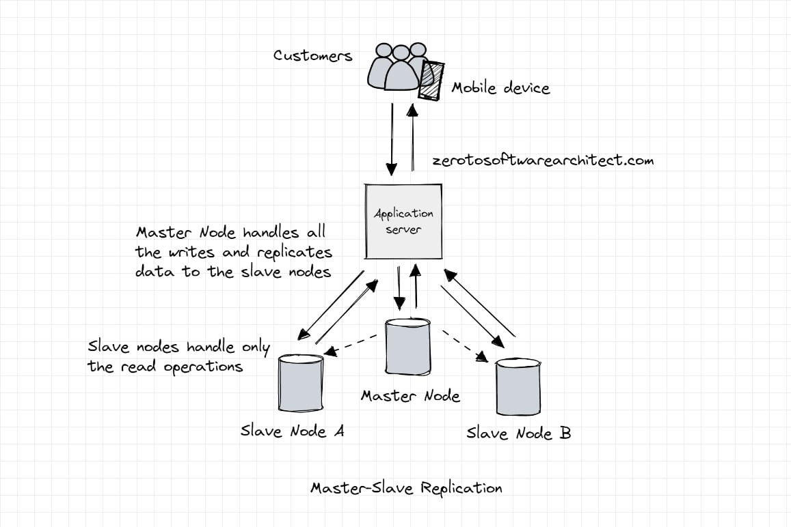
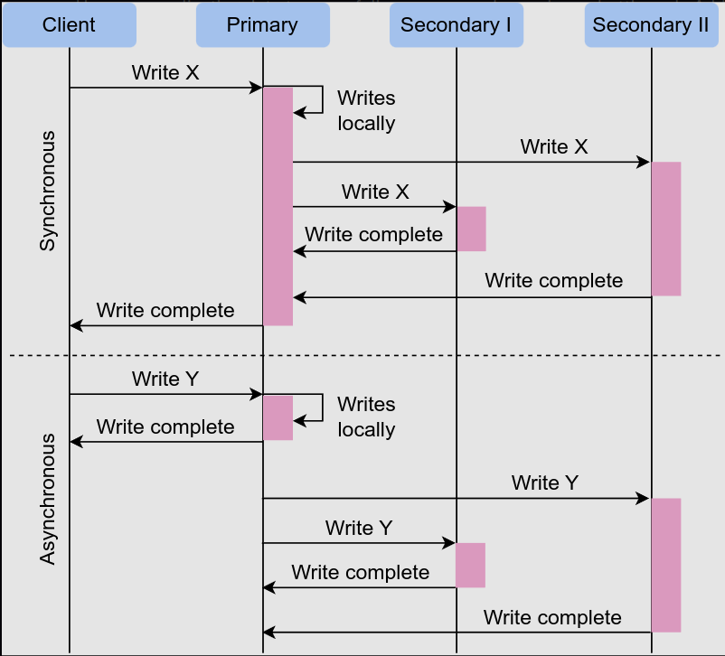

Database replication is the process of copying and maintaining the same data across multiple database servers, ensuring data consistency, high availability, and fault tolerance. It involves creating and managing replicas (or copies) of a database, which can be stored on different servers in various locations.

Therefore, there are two main strategies for replication:
- Pessimistic replication
- Optimistic replication


## Pessimistic replication

**Pessimistic replication** is an approach to managing data replication in distributed systems that enforces strict data consistency across all replicas. In this method, the system ensures that only one copy of the data can be updated at a time, effectively preventing conflicts and eliminating the need for conflict resolution.

To achieve this level of consistency, pessimistic replication uses a global lock or a coordinator to manage write access to the data. When a client wants to update a piece of data, it must first acquire a lock on that data. This lock prevents other clients from making changes to the data simultaneously. Once the client completes the update, the lock is released, and other clients can request access to the data.

### Advantages of pessimistic replication:

- **Strong consistency**: Ensures that all replicas are in sync and up-to-date, providing a consistent view of the data at any given time.
- **No conflicts**: By preventing concurrent updates, pessimistic replication avoids conflicts and eliminates the need for complex conflict resolution mechanisms.

### Disadvantages of pessimistic replication:

- **Performance bottlenecks**: The lock mechanism may lead to performance bottlenecks, especially in systems with high write contention, as clients must wait for locks to be released before they can update the data.

- **Susceptibility to deadlocks and failures**: The system can experience deadlocks and failures if a node holding a lock becomes unavailable, which may require manual intervention to resolve.

Pessimistic replication is well-suited for systems where data consistency is crucial and must be maintained at all times. Examples include financial systems, where accurate and consistent data is critical for transaction processing, and databases managing sensitive information, where data integrity must be preserved. However, it may not be ideal for systems where performance and availability are more important than strict consistency. In those cases, optimistic replication might be a better choice.

## Optimistic replication

**Optimistic replication** is an approach to managing data replication in distributed systems that allows concurrent updates on multiple replicas without enforcing strict consistency. This method improves performance and availability by letting clients read and write data to any replica at any time, without the need to acquire locks or coordinate with other clients.

However, optimistic replication can lead to conflicts when multiple clients update the same data simultaneously. To resolve these conflicts, the system uses various conflict resolution mechanisms, such as timestamps, version vectors, or application-specific logic.

### Advantages of optimistic replication:

- **Higher availability**: By allowing concurrent updates and not relying on a centralized lock manager, optimistic replication provides better availability, making the system more resilient to node failures and network partitions.
- **Better performance**: Without the need to acquire locks or wait for other clients, optimistic replication offers improved performance, particularly in systems with low write contention.
- **Scalability**: Optimistic replication can better handle read and write loads across a distributed system, as it allows for more efficient distribution of requests among replicas.

### Disadvantages of optimistic replication:

- **Weaker consistency**: Data consistency is not guaranteed, leading to potential conflicts and the need for conflict resolution mechanisms.
- **Conflict resolution complexity**: Depending on the nature of the application and data, conflict resolution can be complex and may require additional overhead, such as maintaining version histories or implementing custom logic.

Optimistic replication is well-suited for systems where performance and availability are more important than strict consistency. Examples include distributed file systems, collaborative editing applications, and systems with a high read-to-write ratio. However, it may not be ideal for systems where data consistency is crucial, such as financial systems or databases managing sensitive information. In those cases, pessimistic replication might be a more appropriate choice.

## Master-Slave or Single Master Replication



**Single-master replication** is a replication strategy in which a single primary (or master) database server is responsible for handling all write operations, while one or more replica (or slave) servers are used for read operations and maintaining a copy of the data. The primary server is responsible for propagating changes to the replica servers, ensuring data consistency across the distributed system.

The single-master replication model offers several advantages and disadvantages:

### Advantages:

- **Simplified write operations**: All write operations are directed to a single primary server, simplifying the management of data consistency and eliminating the need for complex conflict resolution mechanisms.

- **Read scalability**: By distributing read operations across multiple replica servers, the single-master replication model can significantly improve read performance and overall system scalability.

- **Controlled data propagation**: The primary server can control the flow of data changes to the replica servers, allowing for various replication techniques (e.g., snapshot, transactional) and configurable latency to accommodate network and system requirements.

### Disadvantages:

- **Write scalability limitations**: As all write operations are handled by the primary server, this can become a bottleneck, limiting the overall write performance of the system.

- **Single point of failure**: The primary server represents a single point of failure, as its unavailability will disrupt write operations and potentially cause data loss. However, this can be mitigated with proper backup and failover strategies.

- **Increased complexity for failover**: In case of primary server failure, promoting a replica server to primary and ensuring data consistency can be a complex process, which might lead to some downtime.

Single-master replication is suitable for systems with a high read-to-write ratio, where the majority of operations are read-intensive, and data consistency is essential. It is commonly used in various applications, including content management systems, reporting systems, and backup systems. However, for systems requiring high write scalability or fault tolerance, other replication models such as multi-master or peer-to-peer replication might be more appropriate.

## Types of Single Master replication

There are several types of single-master replication techniques, each with its own characteristics and use cases. These techniques primarily differ in how data is propagated from the master to the replica servers. Here are some common types of single-master replication:

1. **Snapshot Replication**:

**Snapshot replication** involves creating a full snapshot (or copy) of the master database at a specific point in time and transferring it to the replica servers. This method is relatively simple to implement and provides a consistent copy of the data across all replicas.

- **How it works**: At scheduled intervals or trigger events, the primary server creates a full snapshot of its current data. This snapshot is then transferred to the replica servers, which replace their existing data with the new snapshot. The replicas may be locked or read-only during the snapshot transfer to maintain data consistency.

- **Pros**: Snapshot replication is suitable for infrequently updated databases or when data consistency between replicas isn't critical. It is also useful for initial data synchronization between the primary server and replicas.

- **Cons**: Snapshot replication may not be ideal for large databases or systems with frequent updates, as it requires transferring the entire dataset each time a snapshot is created. This can lead to increased network bandwidth usage and increased load on the primary server.

2. **Transactional Replication**:

**Transactional replication** involves replicating individual transactions from the master server to the replica servers as they occur. This method ensures data consistency between the master and replica databases, providing near real-time updates.

- **How it works**: Whenever a transaction is committed on the primary server, it is immediately propagated to the replica servers. The replicas apply the transaction in the same order as it was executed on the primary server, ensuring data consistency across all nodes.

- **Pros**: Transactional replication provides strong data consistency and near real-time updates. It is suitable for systems with frequent updates or where data consistency between replicas is essential.

- **Cons**: Transactional replication may require more resources and might have higher latency, particularly in systems with high write loads or network limitations. It may also introduce additional complexity in the form of conflict resolution and transaction ordering.

3. **Log Shipping**:

**Log shipping** is a technique that involves periodically transferring database transaction log backups from the master server to one or more replica servers. The replica servers then apply the log backups to maintain an up-to-date copy of the master database.

- **How it works**: The primary server periodically generates transaction log backups, which are then transferred to the replica servers. The replicas apply these log backups in sequence to update their data. The frequency of log backup generation and transfer can be adjusted based on system requirements and network conditions.

- **Pros**: Log shipping is suitable for off-site backups, reporting, or disaster recovery scenarios. It can be used with configurable latency and offers a relatively simple approach to data replication.

- **Cons**: Log shipping may not provide real-time data updates, and the replica servers might be temporarily unavailable during log restoration. Also, it may require additional storage for transaction log backups.

4. **Change Data Capture (CDC)**:

**Change Data Capture** tracks changes made to the master database and asynchronously propagates them to the replica servers. CDC can capture data modifications at the row or column level, depending on the system requirements.

- **How it works**: CDC involves tracking changes (inserts, updates, and deletes) made to the master database, often using triggers or other monitoring mechanisms. These changes are stored in a change log or similar data structure, which is then asynchronously transferred to the replica servers. The replicas apply the changes to update their data.

- **Pros**: CDC provides near real-time updates and is useful for systems that need to maintain a consistent view of the data across multiple servers. It allows for more granular data replication and can be tailored to specific application requirements.

- **Cons**: CDC may require additional resources to track and store changes, and it may introduce complexity in the form of conflict resolution and change log management.

5. **Delayed Replication**:

**Delayed replication** is a variation of single-master replication where changes from the master server are deliberately propagated to the replica servers after a specified delay. This method can be useful for recovery from accidental data modifications or deletions, as it provides a "time buffer" to revert changes before they are replicated to the replica servers.

- **How it works**: In delayed replication, the primary server records data changes and stores them in a queue or buffer for a pre-configured period before sending them to the replica servers. Once the delay period elapses, the changes are propagated to the replicas, which then apply the updates to their data.

- **Pros**: Delayed replication can help recover from accidental data changes or deletions by providing a time window to revert changes before they are propagated to the replicas. It can also be useful in cases where data must be reviewed or approved before being replicated to replica servers.

- **Cons**: Delayed replication introduces latency in data updates, which can result in stale data being served by the replica servers during the delay period. Additionally, it may require more complex monitoring and management of the delay buffer or queue.

Each of these single-master replication techniques has its own advantages and trade-offs. The choice of technique should be based on factors such as data consistency requirements, system performance, network latency, and the frequency of data updates. Some systems may also employ a combination of replication techniques to meet specific requirements or to optimize performance and consistency in different parts of the system.

## Synchronous replication

**Synchronous replication** is a data replication method in which data is written to the primary server and one or more replica servers simultaneously, ensuring data consistency across all nodes in a distributed system. In synchronous replication, the primary server only acknowledges a write operation as successful once it has received confirmation from the replica servers that the data has been written.

### Advantages of synchronous replication:

- **Strong consistency**: Synchronous replication guarantees that all replicas are updated simultaneously, providing strong data consistency across the entire system. This ensures that all nodes have an identical view of the data at any given time.

- **Data protection**: Synchronous replication protects against data loss in the event of a node failure, as the write operation is not considered complete until it is successfully stored on all replicas.

- **Simplified conflict resolution**: Since updates are propagated to all nodes simultaneously, there is no need for complex conflict resolution mechanisms.

### Disadvantages of synchronous replication:

- **Performance overhead**: Synchronous replication can introduce performance overhead due to the additional latency required for waiting on acknowledgements from replica servers. This can be particularly noticeable in systems with high write loads or when replicas are located in geographically distant locations.

- **Reduced availability**: In some cases, synchronous replication can reduce system availability. If a replica server becomes unavailable or experiences network issues, write operations on the primary server may be blocked, waiting for the replica server to acknowledge the data writes.

- **Complexity**: Implementing synchronous replication can be more complex than asynchronous replication, as it requires precise coordination between the primary and replica servers.

Synchronous replication is well-suited for applications that require strong consistency and data protection, such as financial systems, critical infrastructure systems, or databases managing sensitive information. However, for systems where performance and availability are more important than strict consistency, asynchronous replication might be a more suitable option.

## Asynchronous replication

**Asynchronous replication** is a data replication method in which data is written to the primary server and later propagated to one or more replica servers without waiting for their acknowledgements. In this approach, the primary server does not wait for confirmation from the replica servers before acknowledging a write operation as successful.

### Advantages of asynchronous replication:

- **Improved performance**: Asynchronous replication generally offers better performance than synchronous replication because it does not require waiting for acknowledgements from replica servers. This reduces latency and allows the primary server to process more write operations in a shorter amount of time.

- **Higher availability**: Asynchronous replication can provide higher availability than synchronous replication, as the primary server is not blocked by unresponsive or slow replica servers. Write operations can proceed even if some replica servers are temporarily unavailable or experiencing network issues.

- **Scalability**: Asynchronous replication can better handle write loads in a distributed system, as it allows the primary server to continue processing requests without being affected by the performance of replica servers.

### Disadvantages of asynchronous replication:

- **Weaker consistency**: Asynchronous replication does not guarantee immediate data consistency across all nodes in the system. This can lead to temporary discrepancies between the primary server and replica servers, potentially causing conflicts or stale data reads.

- **Risk of data loss**: In the event of a primary server failure, there is a risk of data loss if the most recent changes have not yet been propagated to the replica servers. This risk can be mitigated by using techniques such as write-ahead logging or frequent data synchronization.

- **Conflict resolution**: Asynchronous replication may require conflict resolution mechanisms to handle situations where updates are made to the same data concurrently on different nodes. This can add complexity to the system.

Asynchronous replication is well-suited for applications where performance and availability are more important than strict consistency, such as distributed file systems, web applications with high read-to-write ratios, or systems with geographically dispersed replicas. However, for systems requiring strong consistency and data protection, synchronous replication might be a more appropriate choice.




## Statement-based replication (SBR)

**Statement-based replication (SBR)** is a method of data replication in which SQL statements that modify data on the primary server are recorded and then executed on the replica servers. Instead of replicating the actual data changes, SBR replicates the SQL commands that resulted in those changes. This replication method is typically used in relational database systems.

### How it works:

1. **Capture SQL statements**: When a data modification occurs on the primary server (e.g., `INSERT`, `UPDATE`, or `DELETE` statements), the SQL statement responsible for the change is recorded.

2. **Propagate statements**: The recorded SQL statements are then sent to the replica servers in the order they were executed on the primary server.

3. **Execute statements on replicas**: The replica servers execute the received SQL statements to apply the data changes locally, effectively replicating the data modifications from the primary server.

### Pros:

- **Compatibility**: Statement-based replication is widely supported by many relational database management systems, making it a common choice for cross-platform replication scenarios.

- **Reduced data transfer**: In cases where a single SQL statement affects a large amount of data, SBR can be more bandwidth-efficient than replicating the actual data changes.

- **Maintainability**: Since the SQL statements are human-readable, troubleshooting and auditing the replication process can be easier.

### Cons:

- **Execution context**: Statement-based replication can be affected by the differences in the execution context between the primary and replica servers, such as system variables or user-defined functions. These differences may lead to inconsistencies between the primary and replica data.

    - **Execution context problem**

        Suppose you have a table `sales` with columns `id`, `item`, and `price`. On the primary server, you execute the following SQL statement:

        ```sql
        INSERT INTO sales (item, price) VALUES ('Laptop', ROUND(999.99 * RAND()));
        ```

        In this case, the `RAND()` function generates a random number between `0` and `1`, which is then multiplied by `999.99` and rounded. SBR would replicate the SQL statement itself, not the resulting data. When the replica server executes the statement, the `RAND()` function generates a different random number, leading to a different price value on the replica server compared to the primary server. This inconsistency is due to the different execution contexts of the primary and replica servers.

- **Performance**: Executing SQL statements on the replica servers can be resource-intensive, especially in systems with a high write load. This might impact the performance of the replica servers.

- **Non-deterministic statements**: SBR might lead to data inconsistencies when dealing with non-deterministic SQL statements or functions, as their results may differ when executed on the primary and replica servers.

    - **Non-deterministic statement problem**

        Consider a table `employees` with columns `id`, `name`, `salary`, and `bonus`. On the primary server, you execute the following SQL statement:

        ```sql
        UPDATE employees SET bonus = salary * 0.1 WHERE id = (SELECT id FROM employees ORDER BY RAND() LIMIT 1);
        ```

        This statement updates the bonus for a random employee. Since the `RAND()` function is non-deterministic, it will likely select a different employee on the primary server and the replica server. As a result, the bonus for one employee will be updated on the primary server, while a different employee's bonus will be updated on the replica server, leading to data inconsistencies.

Statement-based replication is suitable for systems where compatibility, maintainability, and reduced data transfer are more important than strict data consistency. However, it is crucial to consider the potential issues related to the execution context and non-deterministic statements when choosing SBR for your replication strategy. In some cases, other replication methods like row-based replication or mixed-mode replication may be more appropriate to ensure data consistency and performance.

## Write-Ahead Log (WAL)

**Write-Ahead Log (WAL)** shipping is a method of data replication in which the transaction logs from the primary server are periodically transferred and applied to the replica servers. WAL shipping is commonly used in database systems to maintain an up-to-date copy of the primary database on the replicas.

### How it works:

1. **Record transactions**: When data modifications occur on the primary server, they are recorded in the write-ahead log (also known as the transaction log or redo log). The log contains a sequential record of all the changes made to the database.

2. **Generate log backups**: At scheduled intervals or after a specific amount of data has been written to the log, the primary server generates a backup of the log, which contains a snapshot of the recent changes.

3. **Transfer log backups**: The log backups are then transferred to the replica servers over the network. The frequency of log backup generation and transfer can be adjusted based on system requirements and network conditions.

4. **Apply log backups on replicas**: The replica servers apply the log backups in the same sequence as they were generated on the primary server, effectively updating their data to match the primary database.

### Pros:

- **Data consistency**: WAL shipping ensures that the replica servers have a consistent view of the primary database, as they apply the same transaction logs in the same order as the primary server.

- **Granular replication**: WAL shipping allows for fine-grained replication of data modifications, enabling near real-time updates and reducing the risk of data loss in case of primary server failure.

- **Lower impact on primary server**: Since the primary server only needs to generate and transfer log backups, the impact on its performance is lower compared to methods like snapshot or transactional replication.

- **Disaster recovery**: WAL shipping is well-suited for off-site backups, reporting, or disaster recovery scenarios, as it maintains an up-to-date copy of the primary database on the replica servers.

### Cons:

- **Increased storage**: WAL shipping may require additional storage for transaction log backups, both on the primary server and the replicas.

- **Replica server downtime**: The replica servers may be temporarily unavailable or read-only during the log backup application, which can impact their availability.

- **Network bandwidth**: Transferring log backups over the network can consume bandwidth, especially in systems with high write loads or large transaction logs.

Write-Ahead Log shipping is a widely used method for maintaining up-to-date replicas of a primary database, offering strong data consistency and granular replication. It is particularly useful in disaster recovery and off-site backup scenarios, as well as systems where minimizing the impact on the primary server's performance is crucial.

### How Write-Ahead Logs (WAL) are created and stored with example?

A **Write-Ahead Log** (**WAL**) is a fundamental component of many database systems, providing a mechanism to ensure data consistency, durability, and recovery. The WAL records all changes to the database, including inserts, updates, and deletes, before they are applied to the actual data files. This allows the database system to recover from failures by replaying the logged changes.

Here's a step-by-step example of how WALs are created and stored:

1. **Begin a transaction**: A user initiates a transaction that involves multiple data modifications. For instance, consider a banking application where a user transfers $100 from account A to account B.

    ```sql
    BEGIN TRANSACTION;
    UPDATE accounts SET balance = balance - 100 WHERE account_id = 'A';
    UPDATE accounts SET balance = balance + 100 WHERE account_id = 'B';
    COMMIT;
    ```

2. **Write to the WAL**: As each modification is executed within the transaction, the database system writes corresponding log records to the WAL. These records include information such as the transaction ID, the type of operation (insert, update, or delete), and the old and new data values.

    For the given example, two log records would be created:

    ```yml
    Record 1: {transaction_id: 1, operation: 'update', table: 'accounts', account_id: 'A', old_balance: 1000, new_balance: 900}
    Record 2: {transaction_id: 1, operation: 'update', table: 'accounts', account_id: 'B', old_balance: 500, new_balance: 600}
    ```

3. **Buffer and write-ahead**: The WAL records are typically buffered in memory for performance reasons. Before the transaction is committed, the buffered log records are flushed to disk to ensure durability. This is the "write-ahead" part of the WAL, as log records are written to disk before the actual data changes are applied to the data files.

4. **Commit the transaction**: Once the log records have been written to disk, the transaction is considered committed. The database system can now apply the data changes to the data files in the background or during a checkpoint.

5. **Store the WAL**: WAL files are usually stored sequentially on disk, often with a predefined size and naming convention. When a WAL file reaches its maximum size, a new file is created, and logging continues in the new file. Older WAL files may be archived or deleted once the changes have been applied to the data files and no longer needed for recovery purposes.

In the event of a crash or failure, the database system can use the WAL to recover the database to a consistent state. It does this by replaying the log records from the last known checkpoint to the end of the WAL, reapplying any committed changes that were not yet written to the data files, and rolling back any uncommitted transactions.

In summary, the Write-Ahead Log (WAL) is a crucial mechanism in database systems for ensuring data consistency and durability. WALs are created by logging data modifications before they are applied to the data files, and they are stored sequentially on disk. In case of failures, the WAL can be used to recover the database to a consistent state.

### If I use a random function, do write ahead logs record the value of the random function and then propogate it to replica servers?

Yes, when using a random function in a database operation, the Write-Ahead Log (WAL) will record the result of the random function, rather than the function itself. The WAL captures the actual data changes resulting from the operation, which ensures data consistency across primary and replica servers.

When the WAL is used to propagate changes to replica servers, the replica servers will apply the same data changes as the primary server, using the recorded values in the log. This approach ensures that the data remains consistent across servers, even when non-deterministic functions like random functions are involved in the data modification.

For example, consider a database operation that inserts a new row with a random value:

```sql
INSERT INTO sample_table (value) VALUES (ROUND(RAND() * 100));
```

When this operation is executed, the random value is generated and inserted into the table. The WAL will then record the new row with the generated random value, for example:

```css
Record: {operation: 'insert', table: 'sample_table', value: 42}
```

During replication, the replica servers will apply the same insert operation with the same recorded value (42 in this case) to their local data, ensuring data consistency between the primary and replica servers.

## Logical (row-based) log replication

**Logical (row-based) log replication**, also known as row-based replication (RBR), is a data replication method in which individual rows affected by data modifications on the primary server are captured and replicated to the replica servers. RBR focuses on replicating the actual data changes rather than the SQL statements that led to those changes, as seen in statement-based replication (SBR).

### How it works:

1. **Capture row changes**: When data modifications occur on the primary server (e.g., `INSERT`, `UPDATE`, or `DELETE` operations), the changes made to the affected rows are recorded in the transaction log or a dedicated change log.

2. **Propagate row changes**: The row changes are then sent to the replica servers in the order they were applied on the primary server. This process can be synchronous or asynchronous, depending on the replication configuration.

3. **Apply row changes on replicas**: The replica servers apply the received row changes to their local data, effectively replicating the data modifications from the primary server.

### Pros:

- **Data consistency**: Row-based replication ensures strong data consistency across the primary and replica servers, as it replicates the actual data changes rather than relying on the execution of SQL statements.

- **Deterministic replication**: RBR eliminates the issues related to non-deterministic SQL statements or functions that may cause inconsistencies in statement-based replication, providing more reliable replication results.

- **Potentially better performance**: In some cases, row-based replication can offer better performance than statement-based replication, especially when dealing with large data modifications or bulk operations.

### Cons:

- **Increased data transfer**: Replicating individual row changes can result in increased data transfer compared to statement-based replication, particularly when a single SQL statement affects many rows. This can lead to higher network bandwidth usage.

- **Incompatibility**: Row-based replication may not be supported by all database systems or may require specific configurations to work correctly, which can introduce complexity in cross-platform replication scenarios.

- **Complexity**: RBR can be more complex to set up and manage compared to other replication methods like statement-based replication, as it may require additional configuration and monitoring.

Logical (row-based) log replication is a suitable option for systems that require strong data consistency and deterministic replication results. It can offer better performance in certain scenarios and is less prone to inconsistencies caused by non-deterministic SQL statements. However, it is essential to consider the potential increase in data transfer and any compatibility issues when choosing RBR for your replication strategy. In some cases, mixed-mode replication, which combines the advantages of both statement-based and row-based replication, may be a more appropriate choice.

## Mixed-mode replication

**Mixed-mode replication** is a combination of statement-based replication (SBR) and row-based replication (RBR) techniques, designed to offer the best of both worlds by leveraging the advantages of each replication method. It is also known as hybrid replication or flexible replication. Mixed-mode replication aims to balance performance, data consistency, and network bandwidth usage.

In mixed-mode replication, the database system dynamically chooses the most appropriate replication method for each individual operation, switching between SBR and RBR as needed. The choice is generally based on predefined rules, heuristics, or the type of SQL statement being executed.

### How it works:

1. **Begin a transaction**: A user initiates a transaction involving multiple data modifications.

2. **Analyze the SQL statement**: For each SQL statement within the transaction, the database system determines whether it is safe to use SBR or if RBR should be used instead. This decision is typically based on factors such as whether the statement is deterministic, whether it has any execution context dependencies, or whether it affects a large number of rows.

3. **Create log records**: Depending on the chosen replication method (SBR or RBR), the database system creates the corresponding log records:

    - For SBR, the log record contains the SQL statement itself.
    - For RBR, the log record contains the actual data changes, such as the affected rows and their old and new values.

4. **Store the log records**: The log records are stored in the database's transaction log or a dedicated binary log, following the order in which they were executed on the primary server.

5. **Propagate and apply changes on replicas**: The log records are sent to the replica servers, which apply the changes using the corresponding replication method (SBR or RBR), maintaining data consistency between the primary and replica servers.

### Pros:

- **Flexibility**: Mixed-mode replication offers more flexibility by choosing the most appropriate replication method for each operation, balancing performance, data consistency, and network bandwidth usage.

- **Better performance**: By dynamically switching between SBR and RBR, mixed-mode replication can achieve better performance than using either method exclusively, especially in scenarios involving a mix of read-heavy and write-heavy workloads.

- **Data consistency**: Mixed-mode replication helps maintain data consistency across primary and replica servers by using RBR for operations that may cause inconsistencies with SBR, such as non-deterministic SQL statements or functions.

### Cons:

- **Complexity**: Implementing and managing mixed-mode replication can be more complex compared to using a single replication method, as it requires additional configuration and monitoring.

- **Compatibility**: Not all database systems support mixed-mode replication, which can limit its applicability in some scenarios.

Mixed-mode replication can be an effective solution for systems that require a balance between performance, data consistency, and network bandwidth usage. However, it is essential to consider the increased complexity and potential compatibility issues when implementing and managing a mixed-mode replication setup.

## Failover

**Failover** is the process of switching to a backup system or a replica server when the primary (master) server fails or becomes unavailable in a single-master replication setup. The main goal of failover is to maintain system availability and minimize downtime. In a single-master replication environment, one of the replica (slave) servers is promoted to be the new primary server, taking over the role of the failed master server.

### The failover process in single-master replication typically involves the following steps:

1. **Detecting failure**: The system needs to detect the failure or unavailability of the primary server. This is usually done through regular health checks or monitoring tools that periodically ping the primary server to ensure it is responsive.

2. **Selecting a new primary server**: Once a failure is detected, the system must choose a suitable replica server to promote as the new primary server. This decision can be based on factors such as data freshness, server performance, or network proximity to clients.

3. **Promoting the new primary server**: The selected replica server is promoted to be the new primary server. This may involve updating its configuration, enabling write operations, and possibly applying any pending data changes that have not yet been replicated from the old primary server.

4. **Redirecting clients**: Clients that were connected to the old primary server need to be redirected to the new primary server. This can be done through various mechanisms, such as DNS updates, load balancers, or client-side failover logic.

5. **Resuming replication**: Once the new primary server is operational, the remaining replica servers must update their configurations to start replicating data from the new primary server.

6. **Recovering the old primary server (optional)**: Depending on the cause of the failure, the old primary server may be repaired and reintegrated into the system as a replica server, or it may be permanently decommissioned.

Failover can be performed manually or automatically, depending on the system's requirements and complexity. Automated failover usually involves specialized tools or scripts that monitor the health of the primary server and initiate the failover process when a failure is detected.

It is essential to note that failover in single-master replication can introduce some risks, such as temporary data inconsistencies or data loss if the new primary server does not have the most recent changes from the old primary server. However, these risks can be mitigated with proper planning, backup strategies, and data synchronization techniques.

### Manual and automatic approach to failover

Failover is the process of switching from a primary server to a replica server when the primary server becomes unavailable or experiences a failure. The goal of failover is to minimize downtime and maintain data availability. Failover can be performed using manual or automatic approaches, each with its own advantages and disadvantages.

1. **Manual failover**:

    In a manual failover process, a system administrator or a support team identifies the failure of the primary server and manually promotes a replica server to act as the new primary server. This process usually involves the following steps:

    1. **Detect the failure**: The support team monitors the system and identifies that the primary server has failed or become unavailable.

    2. **Choose a replica**: The support team selects a suitable replica server, considering factors such as replication lag, data consistency, and server capacity.

    3. **Promote the replica**: The chosen replica server is promoted to the primary server role by updating its configuration and restarting the database service, if necessary.

    4. **Redirect clients**: Client applications are reconfigured to connect to the new primary server, either by updating their connection settings or adjusting the load balancer configuration.

    #### Advantages of manual failover:

    - **Control**: Manual failover allows the support team to have more control over the process and make informed decisions based on the specific circumstances of the failure.

    - **Less complexity**: Manual failover does not require complex automated monitoring and decision-making systems.

    #### Disadvantages of manual failover:

    - **Longer downtime**: Manual failover typically takes longer to execute compared to automatic failover, leading to extended downtime and potential data loss.

    - **Human error**: Manual failover is prone to human error, which can lead to mistakes and inconsistencies during the failover process.

2. **Automatic failover**:

    In an automatic failover process, a monitoring and failover system detects the failure of the primary server and automatically promotes a replica server to the primary role. The steps involved in automatic failover are:

    1. **Detect the failure**: The monitoring system continuously checks the health of the primary server and detects when it has failed or become unavailable.

    2. **Choose a replica**: The failover system automatically selects a suitable replica server based on predefined criteria, such as replication lag, data consistency, and server capacity.

    3. **Promote the replica**: The failover system promotes the chosen replica server to the primary server role by updating its configuration and restarting the database service, if necessary.

    4. **Redirect clients**: Client applications are automatically redirected to the new primary server, either by updating their connection settings or adjusting the load balancer configuration.

    #### Advantages of automatic failover:

    - **Faster recovery**: Automatic failover typically results in shorter downtime and faster recovery compared to manual failover.

    - **Reduced human error**: By automating the failover process, the risk of human error is minimized.

    #### Disadvantages of automatic failover:

    - **Complexity**: Implementing an automatic failover system requires more complex monitoring and decision-making systems compared to manual failover.

    - **False positives**: Automatic failover systems may trigger failovers due to false positives, such as temporary network issues or transient server problems, potentially causing unnecessary disruptions.

Choosing between manual and automatic failover depends on factors such as the specific requirements of the system, the acceptable downtime, and the available resources for implementing and maintaining the failover process.

